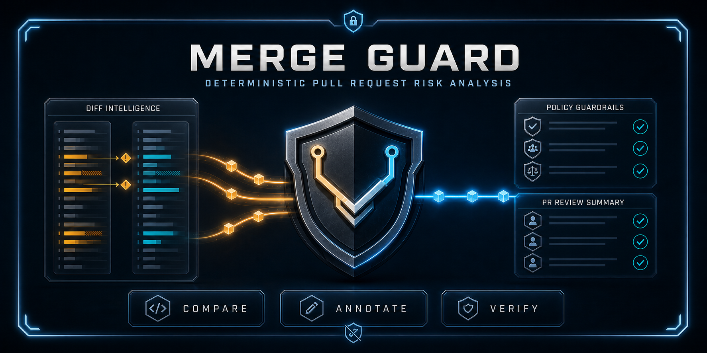

# merge-guard



`merge-guard` is a deterministic pull request and diff risk scanner for safer merges. It reviews changed files and produces a plain-English merge-readiness report: what changed, what looks risky, what might break, and which checks a reviewer should consider before merging.

It does not require an AI provider or API key, and it never runs discovered project commands.

[Quick start](#quick-start) · [CLI](#cli-usage) · [Configuration](#configuration) · [GitHub Action](#reusable-github-action) · [Documentation](#documentation)

> **Pre-release status:** Merge Guard is an active developer-tool prototype. Package metadata remains at `0.1.0`, while the changelog tracks an unreleased `v0.2.0` candidate. This repository has not published an npm release or release tag yet. Use the source checkout or composite GitHub Action, and pin an immutable commit SHA when stability matters.

## What it answers

Merge Guard focuses review on five questions:

1. What changed?
2. Why does it matter?
3. What might break?
4. Which checks should I run?
5. Is this ready to merge?

The report is decision support, not approval. Tests, human review, and repository protection rules remain authoritative.

## Quick start

Merge Guard requires Node.js 18 or newer.

### Use the GitHub Action

Create `.github/workflows/merge-guard.yml` in the repository you want to scan:

```yaml
name: Merge Guard

on:
  pull_request:

permissions:
  contents: read

jobs:
  review:
    runs-on: ubuntu-latest
    steps:
      - uses: actions/checkout@v4
        with:
          fetch-depth: 0

      - uses: keepithandy/merge-guard@main
        with:
          preset: standard
```

`@main` is currently a moving pre-release reference. Pin a commit SHA for a reproducible workflow. See [GitHub Action](#reusable-github-action) for comments, thresholds, annotations, SARIF, and report comparison.

### Run the CLI from source

Clone the repository and run the bundled demo:

```bash
git clone https://github.com/keepithandy/merge-guard.git
cd merge-guard
npm run demo
```

Scan a diff file:

```bash
node src/cli.js path/to/change.diff
```

To scan a sibling project while preserving that project's configuration and repository context, run the CLI with the target repository as the current working directory:

```bash
cd ../your-project
git diff origin/main...HEAD | node ../merge-guard/src/cli.js
```

Alternatively, expose the local checkout as a global command:

```bash
cd ../merge-guard
npm install --global .
cd ../your-project
git diff | merge-guard
```

Inspect or exercise the npm package shape locally without publishing it:

```bash
cd ../merge-guard
npm pack --dry-run
npx --package . merge-guard --help
npx --package . merge-guard --markdown examples/sample.diff
```

Merge Guard reads `merge-guard.config.json`, project metadata, package boundaries, and CODEOWNERS from the current working directory.

## Example output

The bundled `examples/sample.diff` currently produces this abridged report:

```text
merge-guard report

Risk level: LOW
Merge readiness: SAFE_TO_MERGE
Risk score: 1
Preset: standard

Summary:
- 2 file(s) changed
- 3 added line(s)
- 0 removed line(s)

Changed files:
- src/app.js
- src/app.test.js

Risk flags:
- Routing or entry-point logic changed
- Tests changed with implementation
```

The complete report also includes per-file risk, rule explanations, suggested checks and their sources, and repository impact.

## Capabilities on `main`

- Deterministic, rules-based scoring with docs-only handling, risk presets, per-file findings, and merge-readiness labels.
- Plain-text, Markdown, compact pull-request summary, schema-versioned JSON, changed-line annotation, and SARIF 2.1.0 outputs.
- Project configuration for high-risk paths, suggested checks, custom rules, and non-destructive suppressions.
- Read-only JavaScript, Python, mixed-project, and npm-workspace inspection with affected-package mapping.
- Explicit starter policy packs, monorepo policy inheritance, protected-path guidance, and CODEOWNERS hints.
- Pull request context, stable managed comments, immutable report comparison, and a reusable composite GitHub Action.
- Versioned architecture and security contracts for a future local dashboard.

## How scoring works

Merge Guard parses a unified diff and scores signals such as persistence changes, dependency or configuration changes, routing or entry-point changes, missing matching tests, configured high-risk paths, custom rules, and explicitly selected policy rules.

The default preset is `standard`:

| Preset | Review threshold | Failure threshold | Intended use |
| --- | ---: | ---: | --- |
| `safe` | 4 | 9 | Relaxed exploration |
| `standard` | 3 | 7 | General pull-request review |
| `strict` | 2 | 5 | Release branches and sensitive systems |

Scores at or above the review threshold produce `NEEDS_REVIEW`. Scores at or above the failure threshold produce `DO_NOT_MERGE_YET`; `--ci` also exits with status 1 at that threshold. A lower score produces `SAFE_TO_MERGE`, which means no configured high-risk threshold was reached, not that the change is proven safe.

## Configuration

Merge Guard works without configuration. When `merge-guard.config.json` exists in the current working directory, the CLI loads it automatically.

```json
{
  "preset": "standard",
  "highRiskPaths": [
    "src/auth",
    "src/payments"
  ],
  "testCommands": [
    "npm test",
    "npm run smoke"
  ],
  "failThreshold": 7
}
```

| Field | Behavior |
| --- | --- |
| `preset` | Selects `safe`, `standard`, or `strict`. The CLI `--preset` option overrides it. |
| `highRiskPaths` | Adds risk when a changed path starts with one of the configured values. |
| `testCommands` | Adds project-specific commands to suggested checks. Merge Guard reports them but never executes them. |
| `failThreshold` | Sets the positive-integer high-risk and CI failure threshold. `--fail-threshold` overrides it. |
| `customRules` | Adds validated path and/or added-line rules with weights from 0 through 10. |
| `suppressions` | Annotates matching findings with owner, reason, and UTC expiry metadata without changing scores or thresholds. |

Start with [`examples/merge-guard.config.example.json`](examples/merge-guard.config.example.json). Invalid core fields stop the scan with structured diagnostics. Invalid custom rules and suppressions are ignored for scoring and reported as warnings.

### Custom rules

Add `customRules` when a project has risky paths or added-line patterns that the built-in scanner does not cover:

```json
{
  "customRules": [
    {
      "id": "payment-provider-change",
      "label": "Payment provider integration changed",
      "pathPattern": "^src/payments/",
      "linePattern": "fetch\\(|Authorization|webhook",
      "weight": 4,
      "check": "Run the payment-provider sandbox smoke and verify webhook signatures."
    }
  ]
}
```

A custom rule must define `pathPattern`, `linePattern`, or both. If both are present, the same changed file must match the path and contain a matching added line. A weight of `0` records an informational match without increasing risk.

Advanced configuration:

- [Custom rules](docs/custom-rules.md)
- [Rule suppressions](docs/suppressions.md)
- [Configuration diagnostics](docs/configuration-diagnostics.md)
- [Policy inheritance and expiring exceptions](docs/policy-inheritance.md)

## CLI usage

The CLI accepts a unified-diff file or stdin:

```bash
merge-guard change.diff
git diff | merge-guard
merge-guard --help
```

When running from a source checkout, replace `merge-guard` with `node src/cli.js`.

### Output modes

```bash
merge-guard --markdown change.diff
merge-guard --json change.diff
merge-guard --pr-summary change.diff
merge-guard --annotations change.diff > merge-guard-annotations.json
merge-guard --sarif change.diff > merge-guard.sarif
```

`--json`, `--markdown`, `--pr-summary`, `--annotations`, and `--sarif` are mutually exclusive stdout modes. Use `--report-json` to preserve the complete schema-version 1 report alongside any projection:

```bash
merge-guard --pr-summary --report-json merge-guard-report.json change.diff
```

With no explicit stdout projection, CI mode prints Markdown. It always appends a compact summary to `GITHUB_STEP_SUMMARY` when available and enforces the resolved failure threshold:

```bash
merge-guard --ci --preset strict --fail-threshold 5 change.diff
```

`--ai` adds local AI-review data to the report. JSON includes the generated prompt package; text and Markdown show the derived summary and possible breakpoints. It makes no model or network call and requires no API key:

```bash
merge-guard --json --ai change.diff > merge-guard-ai-review.json
```

### Other options

| Option | Purpose |
| --- | --- |
| `--preset <name>` | Select `safe`, `standard`, or `strict`. |
| `--fail-threshold <score>` | Override the high-risk and CI failure threshold with a positive integer. |
| `--pr-title <text>` | Add a pull request title as context. |
| `--pr-body <path>` | Read pull request body context from a UTF-8 text or Markdown file. |
| `--policy <id>` | Explicitly apply `frontend`, `backend`, `library`, `browser-game`, or `infrastructure`. |
| `--policy-config <path>` | Apply an explicit root/package policy manifest. It cannot be combined with `--policy`. |
| `--report-json <path>` | Write the complete JSON report in addition to stdout. |
| `--help`, `-h` | Show the current command contract. |

Pull request title and body are context only. They appear in reports and AI-ready output but never change rules, risk scores, readiness, or failure thresholds.

## Project-specific suggested checks

Before formatting a report, Merge Guard inspects the current repository without executing anything. It can suggest checks from:

- root npm scripts, supported root smoke files, and exact README commands;
- pytest, unittest, Ruff, Black, mypy, Flake8, Python build, and tox metadata;
- mixed JavaScript/Python projects with deterministic deduplication;
- npm workspace arrays or objects, nested packages, and common `apps/*`, `packages/*`, and `services/*` layouts.

Changed paths are mapped to the longest owning package root. Repository-level changes and potential shared impact are labeled explicitly; Merge Guard does not infer dependency relationships.

See [repository intelligence](docs/repository-intelligence.md) for the supported layouts and report fields.

## Policy packs and review guidance

### Policy-pack schema

Merge Guard validates reusable policies against the versioned [`policy-pack-v1` schema](schemas/policy-pack-v1.schema.json). Validation checks identity, compatibility, rules, protected paths, and required checks; it does not select or apply a pack. Pack selection is always explicit.

### Starter policies

Starter policies are opt-in. No policy is selected by default:

```bash
merge-guard --policy frontend change.diff
merge-guard --policy infrastructure change.diff
```

The five bundled packs are `frontend`, `backend`, `library`, `browser-game`, and `infrastructure`. Selected packs add namespaced findings and reasoned required checks; they never execute a command.

For monorepos, `--policy-config merge-guard.policies.json` resolves explicit root and package policy scopes. Expiring exceptions are annotations only: they do not remove findings or checks, change scores, bypass thresholds, or imply approval.

### Expiring policy exceptions

Every exception needs a narrow path expression, reason, owner, real UTC expiry date, and an existing rule, protected-path, or required-check target. Blanket, expired, and malformed exceptions are rejected.

Protected-path matches and CODEOWNERS results are also guidance only. Merge Guard does not assign reviewers, verify repository access, read approvals, or claim that an ownership requirement has been satisfied.

See [starter policy packs](docs/starter-policy-packs.md), [policy inheritance](docs/policy-inheritance.md), and [protected-path/CODEOWNERS guidance](docs/review-guidance.md).

## Reusable GitHub Action

The root [`action.yml`](action.yml) wraps the same CLI. When it builds the pull-request diff, the consuming checkout needs full history (`fetch-depth: 0`). Supplying `diff-path` makes the caller responsible for the diff and removes that requirement from Merge Guard itself.

Enable a stable managed pull-request comment and a strict threshold like this:

```yaml
name: Strict Merge Guard

on:
  pull_request:

permissions:
  contents: read
  pull-requests: write

jobs:
  review:
    runs-on: ubuntu-latest
    steps:
      - uses: actions/checkout@v4
        with:
          fetch-depth: 0

      - uses: keepithandy/merge-guard@main
        with:
          preset: strict
          policy: infrastructure
          comment: "true"
          fail-threshold: "5"
```

Live comments require `pull-requests: write`. Report-only mode does not. To render a comment without writing to GitHub, set both `comment: "true"` and `comment-dry-run: "true"`; that dry-run combination does not need write permission.

### Inputs

| Input | Default | Purpose |
| --- | --- | --- |
| `preset` | `standard` | Risk preset. |
| `policy` | empty | Explicit starter policy ID. |
| `policy-config` | empty | Repository-relative policy manifest; conflicts with `policy`. |
| `comment` | `false` | Post or update the managed pull-request comment. |
| `comment-dry-run` | `false` | With `comment: "true"`, render comment mode without a GitHub write. |
| `fail-threshold` | empty | Positive-integer override. |
| `annotations` | `false` | Emit eligible deduplicated changed-line workflow annotations. |
| `sarif` | `false` | Generate `merge-guard.sarif`; it is not uploaded automatically. |
| `compare` | `false` | Compare the current report with an explicitly supplied prior report. |
| `previous-report` | empty | Optional immutable prior JSON report. If omitted while comparison is enabled, history is reported as unavailable. |
| `diff-path` | empty | Path to a caller-created diff. |
| `markdown` | `true` | Compatibility input; CI and comment reports remain Markdown. |

### Outputs

| Output | Meaning |
| --- | --- |
| `report-path` | Complete JSON report generated from the authoritative diff. |
| `annotations-path` | Annotation bundle path when annotations are enabled. |
| `sarif-path` | SARIF file path when SARIF generation is enabled. |
| `comparison-path` | Finding-comparison JSON path when comparison is enabled. |
| `comparison-status` | `compared`, `history-unavailable`, or `report-unavailable`; empty when comparison is disabled. |

The Action generates the report and optional projections before enforcing the scan exit code, so evidence remains available when the threshold fails. It can generate annotations and SARIF together, even though their direct CLI stdout flags are mutually exclusive.

On `pull_request` events, the Action forwards the event title and body as context only. Comparison is also explicit: Merge Guard never searches workflow history or downloads a previous artifact. Missing previous history is reported as unknown, not clean.

See [GitHub Actions behavior](docs/GITHUB_ACTIONS.md), [pull-request summaries](docs/pull-request-summaries.md), [GitHub annotations and SARIF](docs/github-review-outputs.md), and [finding comparison](docs/finding-comparisons.md).

## Finding comparison

From the Merge Guard source checkout, compare two immutable schema-version 1 reports from successive pushes:

```bash
node scripts/compare-reports.js \
  --previous previous-report.json \
  --current current-report.json \
  --output merge-guard-comparison.json \
  --markdown
```

Findings are classified as new, unchanged, or resolved using stable identities. Comparison does not change either report, scoring, readiness, or the scanner's threshold/CI outcome. If `--previous` is omitted, the comparison helper emits `history-unavailable` and exits with status 2.

## Safety boundaries

- Merge Guard analyzes diffs; it does not replace tests, reviewers, branch protection, or deployment controls.
- Discovered and configured commands are suggestions only and are never executed.
- PR prose is context only; the diff and explicit configuration remain authoritative.
- Suppressions and policy exceptions annotate evidence but never lower scores or bypass thresholds.
- CODEOWNERS and protected paths provide unverified guidance, not proof of approval.
- SARIF generation is local; upload and code-scanning permissions remain the caller's responsibility.
- The planned dashboard currently consists only of versioned architecture, threat-model, and conformance artifacts. No server or browser UI ships on `main`.

The dashboard boundary is documented in [the architecture overview](docs/architecture/dashboard-architecture.md).

## Development and verification

Run the focused contract suites before release work:

```bash
npm run smoke
npm run test:cli
npm run test:snapshots
npm run test:repository
npm run test:policies
npm run test:guidance
npm run test:policy-resolution
npm run test:pr-summary
npm run test:github-review
npm run test:finding-comparison
npm run test:review-e2e
npm run test:dashboard-architecture
npm run release:check
```

`npm run release:check` validates package metadata, required files, Action wiring, CLI execution, sample reports, smoke coverage, and an npm package dry run. These commands inspect artifacts; they do not publish packages, create tags, or create releases.

The compatibility workflow runs the contract suite on Node.js 18, 20, 22, and 24 across Ubuntu and Windows. See the [live Node matrix](.github/workflows/node-lts.yml) and the [v0.2 compatibility record](docs/validation/V0.2_COMPATIBILITY_MATRIX.md).

## Documentation

| Topic | Reference |
| --- | --- |
| Report schema and semantics | [Report format](docs/REPORT_FORMAT.md) |
| Composite Action | [GitHub Actions](docs/GITHUB_ACTIONS.md) |
| Package and release checks | [Package and Action verification](docs/package-and-action.md) |
| Repository-aware checks | [Repository intelligence](docs/repository-intelligence.md) |
| Reusable policies | [Policy-pack contract](docs/policy-packs.md) |
| GitHub review projections | [Annotations and SARIF](docs/github-review-outputs.md) |
| Cross-push findings | [Finding comparison](docs/finding-comparisons.md) |
| Dashboard boundary | [Local dashboard architecture](docs/architecture/dashboard-architecture.md) |
| Release history | [Changelog](CHANGELOG.md) |
| Contributing | [Contributing guide](CONTRIBUTING.md) |
| License | [MIT License](LICENSE) |
