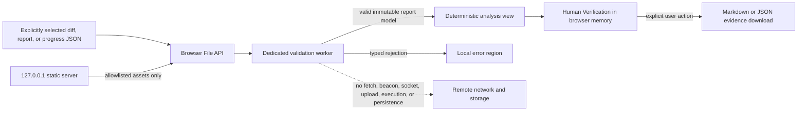

# Local dashboard architecture and security boundary

Tracking: #42 and #68

Status: accepted for local dashboard implementation

Machine contract: `dashboard/architecture-boundary.v1.json`

## Outcome

The dashboard is a local browser application served by a minimal dependency-free Node.js static server bound only to `127.0.0.1` on an ephemeral port. User-selected diffs, reports, and verification-progress files remain inside browser memory. The server serves a fixed set of packaged assets and never receives, parses, stores, or proxies selected files.

Issue #69 implements the constrained loopback runtime and local import validation. The current dashboard adds report exploration, comparison, Review focus, and **Human Verification** without widening the runtime boundary.



## Trust boundaries

| Boundary | Trusted responsibility | Untrusted data | Prohibited behavior |
| --- | --- | --- | --- |
| Node process | Bind loopback, validate the exact Host authority, serve allowlisted packaged assets, attach security headers | URL and request headers | Request bodies, user-file upload, path-derived filesystem reads, proxying, CORS, telemetry |
| Browser document | File picker/drop UX, accessible status, deterministic report display, Human Verification state, explicit export | Filename, report strings, diff text, progress JSON, user-entered notes | Automatic filesystem access, remote requests, persistent storage, active HTML rendering, command execution |
| Module worker | Enforce byte/count/depth/time limits, decode UTF-8, validate shape/version | Complete selected file contents | DOM access, check execution, dynamic code, untrusted regular expressions, network access |
| Export boundary | Serialize validated report-bound Human Verification after a user gesture | Paths, reasons, PR context, checks, environment metadata, notes, runtime defects | Recalculation, executable output, implicit download, retained object URLs, media upload |

The local operating system, Node runtime, browser, and installed Merge Guard package are trusted. A compromised browser, runtime, package installation, or local account is outside this application threat model. Malicious or malformed selected files and hostile pages attempting to reach loopback are in scope.

## Process boundary

The entry point is `node dashboard/server.js`.

- Bind exactly `127.0.0.1`, never an omitted host, `0.0.0.0`, or a LAN interface.
- Ask the operating system for an ephemeral port and print the exact local URL.
- Accept only `GET` and `HEAD`; return `405` for every other method before consuming a body.
- Resolve URLs through an explicit asset map. Never concatenate a request path with a filesystem root, follow a symlink, list a directory, or fall back to arbitrary files.
- Accept only the exact `127.0.0.1:<selected-port>` Host authority.
- Set `Cache-Control: no-store`, `X-Content-Type-Options: nosniff`, `Referrer-Policy: no-referrer`, `Cross-Origin-Resource-Policy: same-origin`, and the contract CSP on every response.
- Do not enable CORS, WebSocket upgrades, HTTP CONNECT, remote imports, update checks, analytics, or request logging containing user data.
- Keep the runtime dependency-free.

The server is not an upload endpoint. Selected files enter through the browser File API and do not cross into the Node process. Human Verification adds only one allowlisted local module, `human-verification.js`.

## Browser and file boundary

Files are accessible only after an explicit `<input type="file">` selection or desktop drop. Extensions and MIME values are usability hints, not trust signals; content and schema validation remain authoritative.

| Input | Limit | Required content | Rejected |
| --- | ---: | --- | --- |
| UTF-8 `.diff` or `.patch` | 20 MiB and 200,000 lines | At least one `diff --git ` marker and parseable unified-diff structure | NUL bytes, archives, binary patches, decoding failure, limit breach |
| Merge Guard `.json` report | 10 MiB each; at most two | Object root, `tool: "merge-guard"`, report `schemaVersion: 1`, required v1 report fields | Arrays/scalars at root, unknown schema, excessive JSON depth/cardinality, archives, limit breach |
| Verification-progress `.json` | 10 MiB; at most one; depth 64; 50,000 checks | Object root, `tool: "merge-guard-verification-progress"`, schema `1` or `2`, SHA-256 report binding | Arrays/scalars at root, malformed/unknown schema, invalid digest, duplicate identities, invalid statuses, excessive cardinality, archives, limit breach |

Verification-progress schema v1 remains accepted for compatibility. Its binary `completed` field is not silently redefined: the restore UI explicitly states that `completed=true` migrates to **Pass** and incomplete entries to **Untested** before a schema-v2 export is created.

Schema v2 records report identity when explicitly available, a verification-session identity and timestamps, optional environment metadata, explicit `untested` / `pass` / `fail` / `na` statuses, notes, user-added checks, and human-observed runtime defects. Runtime-defect evidence references are text only. Binary screenshots/video, clipboard media, directories, URLs as import targets, and arbitrary JSON remain unsupported.

## Validation and state transition

1. Check item count, filename length, declared byte size, and allowed extension before reading.
2. Read as an `ArrayBuffer`, decode with a fatal UTF-8 decoder, and verify actual byte/line limits.
3. Parse in a dedicated module worker. Terminate work that exceeds 10 seconds.
4. Validate type, version, required shape, depth, collection limits, verification statuses, provenance, and defect shape before constructing a view model.
5. Canonicalize each accepted report in memory and calculate its SHA-256 binding. Apply imported verification evidence only when that binding exactly matches one selected report. A mismatch remains visible and unapplied; the selected evidence file is never modified.
6. Commit report/diff state only after complete validation. A failed import leaves the prior valid view intact.
7. Create current Human Verification only on explicit user action. Every generated/current-build check starts Untested. Previous report evidence never carries forward as current Pass.
8. Drop original buffers and stale worker messages after completion or cancellation.

No selected string is evaluated, used as a module path, compiled as a regular expression, inserted with `innerHTML`, or passed to a shell. Dynamic display uses DOM `textContent` or equivalently safe attribute assignment. The UI never executes suggested checks or imported project code.

## Scoring boundary

An imported report is authoritative. The dashboard displays its score, readiness, files, rules, warnings, suppressions, and checks without recalculating them. **Human Verification is a separate evidence channel.** Pass, Fail, N/A, notes, custom checks, environment data, and runtime defects do not alter risk score, thresholds, findings, `mergeReadiness`, `reviewDecision`, or `NO_CONFIGURED_BLOCKERS` semantics.

A human-observed runtime defect is intentionally not a Merge Guard scoring finding. Conversely, a human Pass does not lower deterministic risk. The two channels are displayed beside one another as deterministic analysis and observed runtime evidence.

For a raw diff, the worker may call only the shared browser-safe Merge Guard analysis core. It must not create a second scorer. Repository filesystem intelligence, local config, CODEOWNERS, and policy manifests are unavailable unless a future version defines a separate explicit input bundle.

Comparison uses the same stable source + rule ID + path identity as the dashboard comparator and accepts at most two compatible v1 reports. New findings are prioritized for current verification; unchanged findings retain comparison context but are not presumed retested; resolved findings are shown as report-comparison state and never become manual Pass. Review focus remains descriptive and cannot approve a pull request.

## Network and storage boundary

The required Content Security Policy is:

```text
default-src 'none'; connect-src 'none'; img-src 'self' data:; style-src 'self'; style-src-attr 'none'; script-src 'self'; script-src-attr 'none'; worker-src 'self'; font-src 'self'; object-src 'none'; base-uri 'none'; form-action 'none'; frame-src 'none'; frame-ancestors 'none'; manifest-src 'none'
```

`connect-src 'none'` blocks script-driven `fetch`, XHR, WebSocket, EventSource, beacon, and ping destinations. Scripts, styles, worker modules, fonts, and interface assets are packaged locally. There are no remote origins, API calls, CDNs, accounts, API keys, telemetry, update checks, cloud persistence, automatic GitHub writes, automatic issue creation, or media uploads.

Selected content and derived Human Verification state live in JavaScript memory only. Do not use localStorage, sessionStorage, IndexedDB, Cache Storage, cookies, a service worker, temporary server files, or remote storage. Reloading or closing the tab clears state. Markdown and JSON exports require an explicit action; object URLs are revoked immediately after download is initiated.

## Error contract

Errors use stable categories: `too-large`, `unsupported-type`, `invalid-encoding`, `malformed-input`, `incompatible-schema`, and `processing-timeout`.

Messages identify the selected filename and violated contract without exposing an absolute local path, stack, source excerpt, token, or environment value. Invalid input never renders partially or replaces the prior valid report. A report-binding mismatch is not treated as clean evidence: the mismatch is shown and the progress file is left unapplied.

## Verification gate

```bash
npm run test:dashboard-architecture
npm run test:dashboard-import
npm run test:dashboard-comparison
npm run test:dashboard-verification-progress
npm run test:dashboard-review-focus
npm run test:dashboard-explorer
npm run test:dashboard-accessibility
```

The gates cover the versioned manifest/schema, exact loopback and method policy, input limits, CSP prohibitions, memory-only storage, non-execution/scoring boundaries, legacy/current verification evidence, binding behavior, comparison isolation, runtime-defect separation, accessibility, error categories, and packaged documentation. Any boundary relaxation requires an explicit manifest/ADR review; changing prose alone is insufficient.

## Primary references

- [MDN: Using files from web applications](https://developer.mozilla.org/en-US/docs/Web/API/File_API/Using_files_from_web_applications)
- [MDN: File API](https://developer.mozilla.org/en-US/docs/Web/API/File_API)
- [MDN: Content Security Policy header](https://developer.mozilla.org/en-US/docs/Web/HTTP/Reference/Headers/Content-Security-Policy)
- [MDN: `connect-src`](https://developer.mozilla.org/en-US/docs/Web/HTTP/Reference/Headers/Content-Security-Policy/connect-src)
- [OWASP: File Upload Cheat Sheet](https://cheatsheetseries.owasp.org/cheatsheets/File_Upload_Cheat_Sheet.html)
- [OWASP: HTML5 Security Cheat Sheet](https://cheatsheetseries.owasp.org/cheatsheets/HTML5_Security_Cheat_Sheet.html)
- [Node.js HTTP documentation](https://nodejs.org/api/http.html)
