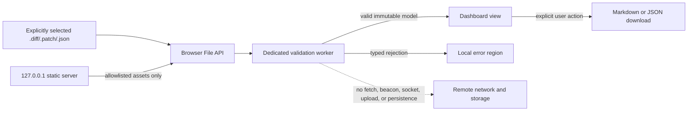

# Local dashboard architecture and security boundary

Tracking: #42 and #68

Status: accepted for v0.6 implementation

Machine contract: `dashboard/architecture-boundary.v1.json`

## Outcome

The v0.6 dashboard will be a local browser application served by a minimal dependency-free Node.js static server bound only to `127.0.0.1` on an ephemeral port. User-selected diffs and reports remain inside browser memory. The server serves a fixed set of packaged assets and never receives, parses, stores, or proxies selected files.

Issue #68 defined this boundary. Issue #69 implements the constrained loopback runtime and local import validation; it does not yet ship the file-risk explorer, checklist, or exports planned for #70 and #71.



## Trust boundaries

| Boundary | Trusted responsibility | Untrusted data | Prohibited behavior |
| --- | --- | --- | --- |
| Node process | Bind loopback, validate the exact Host authority, serve allowlisted packaged assets, attach security headers | URL and request headers | Request bodies, user-file upload, path-derived filesystem reads, proxying, CORS, telemetry |
| Browser document | File picker/drop UX, accessible status, immutable view state, explicit export | Filename, report strings, diff text, dropped-item metadata | Automatic filesystem access, remote requests, persistent storage, active HTML rendering |
| Module worker | Enforce byte/count/depth/time limits, decode UTF-8, validate shape/version, invoke only shared Merge Guard analysis code | Complete selected file contents | DOM access, check execution, dynamic code, untrusted regular expressions, network access |
| Export boundary | Serialize the already validated model after a user gesture | Paths, reasons, PR context, checks | Recalculation, executable output, implicit download, retained object URLs |

The local operating system, Node runtime, browser, and installed Merge Guard package are trusted. A compromised browser, runtime, package installation, or local account can already read local data and is outside this application threat model. Malicious or malformed selected files and hostile pages attempting to reach loopback are in scope.

## Process boundary

The planned entry point is `node dashboard/server.js`.

- Bind exactly `127.0.0.1`, never an omitted host, `0.0.0.0`, or a LAN interface.
- Ask the operating system for an ephemeral port and print the exact local URL.
- Accept only `GET` and `HEAD`; return `405` for every other method before consuming a body.
- Resolve URLs through an explicit asset map. Never concatenate a request path with a filesystem root, follow a symlink, list a directory, or fall back to arbitrary files.
- Accept only the exact `127.0.0.1:<selected-port>` Host authority. Reject missing, alternate, forwarded, or rebinding-oriented Host values.
- Set `Cache-Control: no-store`, `X-Content-Type-Options: nosniff`, `Referrer-Policy: no-referrer`, `Cross-Origin-Resource-Policy: same-origin`, and the contract CSP on every response, including worker scripts.
- Do not enable CORS, WebSocket upgrades, HTTP CONNECT, remote imports, update checks, analytics, or request logging that includes user-controlled query data.
- Keep the runtime dependency-free. Build-time dependencies, if later approved, must produce committed/local assets and cannot add runtime network behavior.

The server is not an upload endpoint. Selected files enter through the browser File API and do not cross into the Node process.

## Browser and file boundary

Files are accessible only after an explicit `<input type="file">` selection or desktop drop. The browser receives `File` objects and checks `File.size` before reading. Extensions and MIME values are usability hints, not trust signals; content and schema validation remain authoritative.

Supported v0.6 inputs are deliberately narrow:

| Input | Limit | Required content | Rejected |
| --- | ---: | --- | --- |
| UTF-8 `.diff` or `.patch` | 20 MiB and 200,000 lines | At least one `diff --git ` marker and parseable unified-diff structure | NUL bytes, archives, binary patches, decoding failure, limit breach |
| Merge Guard `.json` report | 10 MiB each; at most two | Object root, `tool: "merge-guard"`, report `schemaVersion: 1`, required v1 report fields | Arrays/scalars at root, unknown schema, excessive JSON depth/cardinality, archives, limit breach |

Report structural limits are depth 64, 10,000 files, 50,000 rules, and 10,000 suggested checks. SARIF, annotation bundles, HTML, archives, URLs, directories, clipboard HTML, and arbitrary JSON are not dashboard inputs in v0.6. Drag-and-drop must ignore non-file items and reject directories clearly.

## Validation and state transition

1. Check item count, filename length, declared byte size, and allowed extension before reading.
2. Read as an `ArrayBuffer`, decode with a fatal UTF-8 decoder, and verify the actual byte/line limit.
3. Parse in a dedicated module worker. Terminate work that exceeds 10 seconds.
4. Validate type, version, required shape, depth, and collection limits before constructing a view model.
5. Commit the new immutable state only after complete validation. A failed import leaves the previous valid view intact and moves focus to a typed error summary.
6. Drop the original buffer and stale worker messages after completion or cancellation.

No selected string is evaluated, used as a module path, compiled as a regular expression, inserted with `innerHTML`, or passed to a shell. Dynamic display uses DOM `textContent` or equivalently safe attribute assignment. The UI never executes suggested checks.

## Scoring boundary

An imported report is authoritative. The dashboard displays its score, readiness, files, rules, warnings, suppressions, and checks without recalculating them.

For a raw diff, the worker may call only the shared browser-safe Merge Guard analysis core. It must not create a second scorer. Repository filesystem intelligence, local config, CODEOWNERS, and policy manifests are unavailable unless a future version defines a separate explicit, versioned input bundle. The UI must label the capabilities used for each analysis.

Comparison uses the same stable identity/comparison module as the CLI and accepts at most two compatible v1 reports. Missing or incompatible history is unknown/error, never an empty clean baseline.

## Network and storage boundary

The required Content Security Policy is:

```text
default-src 'none'; connect-src 'none'; img-src 'self' data:; style-src 'self'; style-src-attr 'none'; script-src 'self'; script-src-attr 'none'; worker-src 'self'; font-src 'self'; object-src 'none'; base-uri 'none'; form-action 'none'; frame-src 'none'; frame-ancestors 'none'; manifest-src 'none'
```

`connect-src 'none'` blocks script-driven `fetch`, XHR, WebSocket, EventSource, beacon, and ping destinations. Scripts, styles, worker modules, fonts, and interface assets are packaged locally. There are no remote origins, API calls, CDNs, accounts, API keys, telemetry, update checks, or cloud persistence.

Selected content and derived state live in JavaScript memory only. Do not use localStorage, sessionStorage, IndexedDB, Cache Storage, cookies, a service worker, temporary server files, or remote storage. Reloading or closing the tab clears state. Markdown/JSON exports require an explicit action; object URLs are revoked immediately after the download is initiated.

## Error contract

Errors use stable categories: `too-large`, `unsupported-type`, `invalid-encoding`, `malformed-input`, `incompatible-schema`, and `processing-timeout`.

Messages identify the selected filename and violated contract without exposing an absolute local path, stack, source excerpt, token, or environment value. Invalid input never renders partially or replaces the prior valid report. Unknown fields may be ignored only when the report v1 contract explicitly permits additive data; required-field and type failures are fatal.

## Verification gate

```bash
npm run test:dashboard-architecture
```

The gate checks the versioned manifest/schema, exact loopback and method policy, input limits, CSP prohibitions, memory-only storage, non-execution/scoring boundaries, error categories, threat coverage, packaged documentation, and Node matrix integration. Any boundary relaxation requires an explicit manifest version/ADR review; changing prose alone is insufficient.

## Primary references

- [MDN: Using files from web applications](https://developer.mozilla.org/en-US/docs/Web/API/File_API/Using_files_from_web_applications)
- [MDN: File API](https://developer.mozilla.org/en-US/docs/Web/API/File_API)
- [MDN: Content Security Policy header](https://developer.mozilla.org/en-US/docs/Web/HTTP/Reference/Headers/Content-Security-Policy)
- [MDN: `connect-src`](https://developer.mozilla.org/en-US/docs/Web/HTTP/Reference/Headers/Content-Security-Policy/connect-src)
- [OWASP: File Upload Cheat Sheet](https://cheatsheetseries.owasp.org/cheatsheets/File_Upload_Cheat_Sheet.html)
- [OWASP: HTML5 Security Cheat Sheet](https://cheatsheetseries.owasp.org/cheatsheets/HTML5_Security_Cheat_Sheet.html)
- [Node.js HTTP documentation](https://nodejs.org/api/http.html)
